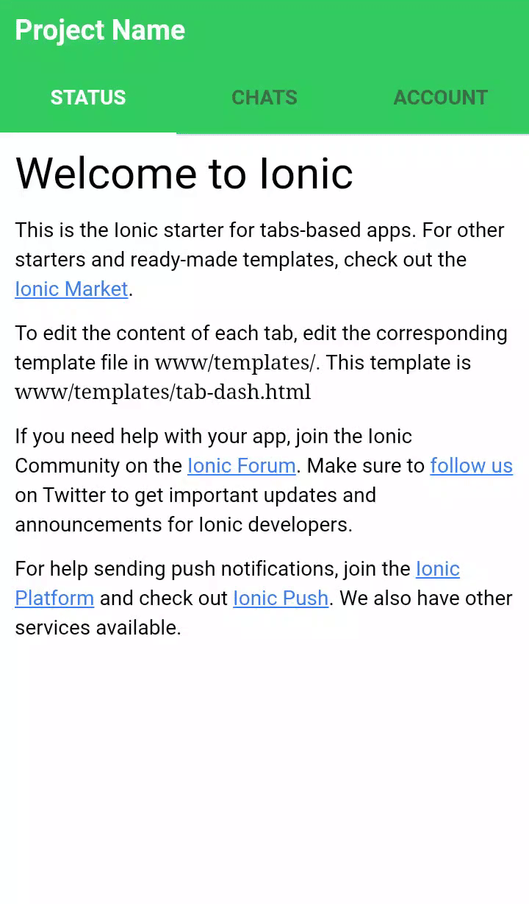

This is an addon starter template based  on Android Tabs for the [Ionic Framework](http://ionicframework.com/) v1.



## How to use this template

*This template does not work on its own*. It is missing the Ionic library, and AngularJS.

To use this, either create a new ionic project using the ionic node.js utility, or copy and paste this into an existing Cordova project and download a release of Ionic separately.

### Start Project:
```bash
$ npm install -g ionic cordova
$ git clone https://github.com/deltcod/AndroidIonicTabs.git
$ cd AndroidIonicTabs/
```

Then, to run it, cd into `myApp` and run:

```bash
$ ionic platform add android
$ ionic run android
```
